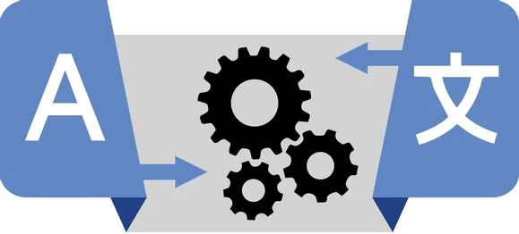

# Machine Translation Dataset List

<h2>Table of Contents</h2>

* [General Dataset](#general_dataset)
* [Task Specific Dataset](#task_specific_dataset)
  * [Bias Mitigation Dataset](#bias_mitigation_dataset)
  * [Document Level Dataset](#document_level_dataset)
  * [Domain Adaptation Dataset](#domain_adaptation_dataset)
  * [Low-Resource Language Dataset](#low_resources_dataset)
  * [Multi-modal Dataset](#multi_modal_dataset)
* [Findings](#findings)

<h2 id="general_dataset">General Dataset</h2> 

* [WikiMatrix: Mining 135M Parallel Sentences in 1620 Language Pairs from Wikipedia](https://arxiv.org/pdf/1907.05791). Holger Schwenk, Vishrav Chaudhary, Shuo Sun, Hongyu Gong, Francisco Guzmán (EACL 2021)
* [MLQE-PE: A Multilingual Quality Estimation and Post-Editing Dataset](https://aclanthology.org/2022.lrec-1.530/). Marina Fomicheva, Shuo Sun, Erick Fonseca, Chrysoula Zerva, Frédéric Blain, Vishrav Chaudhary, Francisco Guzmán, Nina Lopatina, Lucia Specia, André F. T. Martins (LREC 2022)
* [OPUS-100 CORPUS: Improving Massively Multilingual Neural Machine Translation and Zero-Shot Translation](https://github.com/EdinburghNLP/opus-100-corpus). Biao Zhang, Philip Williams, Ivan Titov, Rico Sennrich (ACL 2020)
* [CCMatrix: Mining Billions of High-Quality Parallel Sentences on the WEB](https://github.com/facebookresearch/LASER/tree/main/tasks/CCMatrix). Holger Schwenk, Guillaume Wenzek, Sergey Edunov, Edouard Grave, Armand Joulin (ACL-IJCNLP 2021)
* [JParaCrawl: A Large-scale English-Japanese Parallel Corpus](https://www.kecl.ntt.co.jp/icl/lirg/jparacrawl/). Makoto Morishita, Katsuki Chousa, Jun Suzuki, Masaaki Nagata (LREC 2022)
* [WIT3: Web Inventory of Transcribed and Translated Talks](https://wit3.fbk.eu/). Mauro Cettolo, Christian Girardi, Marcello Federico (EAMT 2012)

<h2 id="task_specific_dataset">Task Specific Dataset</h2> 
<h3 id="bias_mitigation_dataset"> [1] Bias Mitigation Dataset </h3>

* [“I’m sorry to hear that”: Finding New Biases in Language Models with a Holistic Descriptor Dataset](https://arxiv.org/abs/2205.09209). Eric Michael Smith, Melissa Hall, Melanie Kambadur, Eleonora Presani, Adina Williams (EMNLP 2022)
* [The Gender-GAP Pipeline: A Gender-Aware Polyglot Pipeline for Gender Characterisation in 55 Languages](https://github.com/facebookresearch/ResponsibleNLP/tree/main/gender_gap_pipeline). Muller, Benjamin and Alastruey, Belen and Hansanti, Prangthip and Kalbassi, Elahe and Ropers, Christophe and Smith, Eric Michael and Williams, Adina and Zettlemoyer, Luke and Andrews, Pierre and Costa-juss (WMT 2023)
* [WinoMT: A dataset that evaluates gender bias in MT](https://github.com/gabrielStanovsky/mt_gender). Gabriel Stanovsky, Noah A. Smith, Luke Zettlemoyer (ACL 2019)
* [Reducing Gender Bias in Neural Machine Translation as a Domain Adaptation Problem](https://github.com/DCSaunders/gender-debias). Danielle Saunders, Bill Byrne (ACL 2020)

<h3 id="document_level_dataset"> [2] Document Level Dataset </h3>

* [M3T: A New Benchmark Dataset for Multi-Modal Document-Level Machine Translation](https://github.com/amazon-science/m3t-multi-modal-translation-bench). Benjamin Hsu, Xiaoyu Liu, Huayang Li, Yoshinari Fujinuma, Maria Nadejde, Xing Niu, Ron Litman, Yair Kittenplon, Raghavendra Pappagari (NAACL 2024)
* [Analysing concatenation approaches to document-level NMT in two different domains](https://github.com/Helsinki-NLP/doclevel-MT-benchmark?tab=readme-ov-file). Scherrer, Yves and Tiedemann, Jorg and Loaiciga, Sharid (ACL 2019)
* [Document-Level Machine Translation with Large Language Models](https://github.com/longyuewangdcu/Document-MT-LLM). Wang, Longyue and Lyu, Chenyang and Ji, Tianbo and Zhang, Zhirui and Yu, Dian and Shi, Shuming and Tu, Zhaopeng (arXiv 2023)
* [Document-Level Neural Machine Translation with Hierarchical Attention Networks](https://github.com/idiap/HAN_NMT?tab=readme-ov-file). Lesly Miculicich, Dhananjay Ram, Nikolaos Pappas, James Henderson (EMNLP 2018)

<h3 id="domain_adaptation_dataset"> [3] Domain Adaptation Dataset </h3>

* [FGraDA: A Dataset and Benchmark for Fine-Grained Domain Adaptation in Machine Translation](https://github.com/NJUNLP/FGraDA?tab=readme-ov-file). Wenhao Zhu, Shujian Huang, Tong Pu, Pingxuan Huang, Xu Zhang, Jian Yu, Wei Chen, Yanfeng Wang, Jiajun Chen (LREC 2022)

<h3 id="low_resources_dataset"> [4] Low-Resource Language Dataset </h3>

* [The FLORES-101 Evaluation Benchmark for Low-Resource and Multilingual Machine Translation](https://aclanthology.org/2022.tacl-1.30/). Naman Goyal, Cynthia Gao, Vishrav Chaudhary, Peng-Jen Chen, Guillaume Wenzek, Da Ju, Sanjana Krishnan, Marc’Aurelio Ranzato, Francisco Guzmán, Angela Fan (TACL 2022)
* [The FLORES-200 Evaluation Benchmark for Low-Resource and Multilingual Machine Translation](https://github.com/facebookresearch/flores/blob/main/flores200/README.md). Naman Goyal, Cynthia Gao, Vishrav Chaudhary, Peng-Jen Chen, Guillaume Wenzek, Da Ju, Sanjana Krishnan, Marc’Aurelio Ranzato, Francisco Guzmán, Angela Fan
* [IWSLT: A series of low-resource machine translation tasks, focusing on languages with limited parallel data.](https://iwslt.org/2021/low-resource)
* [ParaCrawl: Web-scale parallel corpora for the languages of the EU](https://paracrawl.eu/). Miquel Esplà, Mikel Forcada, Gema Ramírez-Sánchez, Hieu Hoang (MTSummit 2019)
* [Not Low-Resource Anymore: Aligner Ensembling, Batch Filtering, and New Datasets for Bengali-English Machine Translation](https://huggingface.co/datasets/csebuetnlp/BanglaNMT). Tahmid Hasan, Abhik Bhattacharjee, Kazi Samin, Masum Hasan, Madhusudan Basak, M. Sohel Rahman, Rifat Shahriyar (EMNLP 2020)
* [Resources for Bangla Natural Language Processing (BanglaNLP)](https://github.com/banglanlp/bnlp-resources?tab=readme-ov-file). Firoj Alam, Arid Hasan, Tanvirul Alam, Akib Khan, Janntatul Tajrin, Naira Khan, Shammur Absar Chowdhury (2021)
* [Bangla Natural Language Inference (NLI) and Bangla Question Answering (QA) datasets](https://github.com/csebuetnlp/banglabert). Abhik Bhattacharjee, Tahmid Hasan, Wasi Ahmad, Kazi Samin Mubasshir, Md Saiful Islam, Anindya Iqbal, M. Sohel Rahman, Rifat Shahriyar (EMNLP 2021)

 
<h3 id="multi_modal_dataset"> [5] Multi-modal Dataset </h3>

* [3AM: An Ambiguity-Aware Multi-Modal Machine Translation Dataset](https://aclanthology.org/2024.lrec-main.1/). Xinyu Ma, Xuebo Liu, Derek F. Wong, Jun Rao, Bei Li, Liang Ding, Lidia S. Chao, Dacheng Tao, Min Zhang (LREC-COLING 2024)
* [Multi30K is a large-scale multilingual multimodal dataset](https://github.com/multi30k/dataset?tab=readme-ov-file). Elliott, Desmond	and Frank, Stellaand Sima'an, Khaliland Specia, Lucia (ACL 2017)
* [The Flickr30k dataset is a popular benchmark for sentence-based picture portrayal](https://www.kaggle.com/datasets/eeshawn/flickr30k). Peter Young, Alice Lai, Micah Hodosh, Julia Hockenmaier (ACL)
* [Multilingual TEDx Corpus for Speech Recognition and Translation](https://www.openslr.org/100/). Elizabeth Salesky, Matthew Wiesner, Jacob Bremerman, Roldano Cattoni, Matteo Negri, Marco Turchi, Douglas W. Oard, Matt Post (Interspeech 2021)

<h2 id="findings">Findings</h2> 
